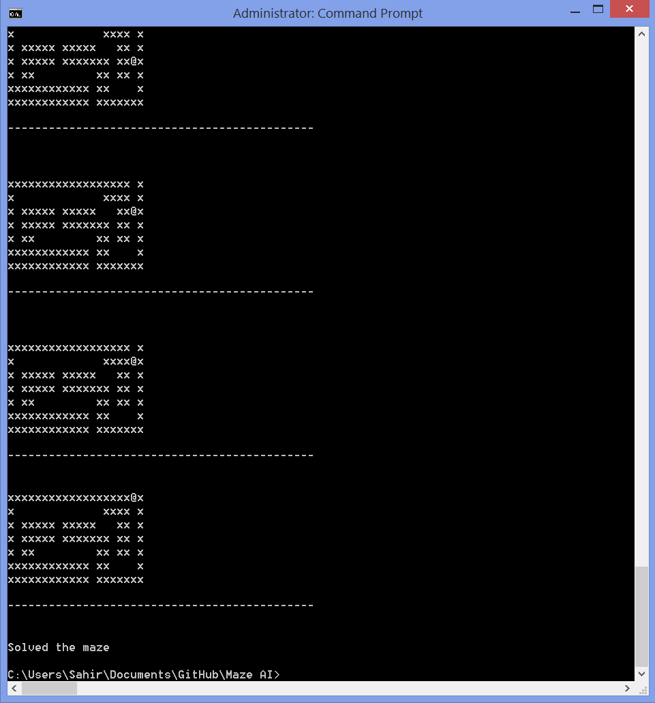

# Maze-AI

Artificial Intelligence Maze Solver

Programming Fundamentals II 

Note: maze.h and maze.cpp were provided by the professor

The purpose of the project was to implement a DFS solution that can solve a maze, if possible. The program reads in the maze as a simple text file. There are three samples given. The current maze being solved may be changed in MazeDriver.cpp. The program then tries all possible paths until either the exit is found. If that case is never reached, a simple message is printed and the program terminates. To account for potential infinte cycles, paths already visited are tracked in the form of an integer matrix. During execution, a simple cin.ignore() is used so that the user has to hit any keyboard key to trigger the next step in the solving process, making it much easier to see what's actually going on. The maze is printed at each step, showing the current location of the icon in the maze. Upon completion, a simple message is printed to tell whether or not the maze was solved.

Directions

Compile and run MazeDriver.cpp. Hit any key to make the AI move a step. To change the maze being solved, change the defined value of MAZE_FILE in MazeDriver.cpp to the name of the desired maze text file. 

